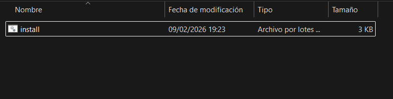
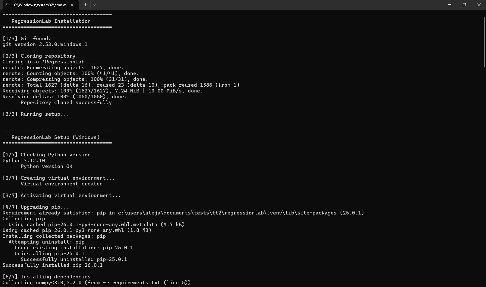

# Installation Guide

This guide will help you install RegressionLab on your computer. There are multiple installation methods available, from a quick automated setup to manual installation for advanced users.

## Prerequisites

Before installing RegressionLab, ensure you have:

### Required Software
- **Git**: Version control system for cloning the repository.
  - Windows: Download from [git-scm.com](https://git-scm.com/install/windows).
  - macOS: Install via Homebrew `brew install git` or download from [git-scm.com](https://git-scm.com/install/mac).
  - Linux: `sudo apt-get install git` (Debian/Ubuntu), `sudo dnf install git` (Fedora), `sudo zypper install git` (openSUSE), or `sudo pacman -S git` (Arch). The `install.sh` script can also offer to install Git automatically on supported distributions.

- **Python**: Version 3.12 or higher (3.13 supported).
  - Download from [python.org](https://www.python.org/downloads/).
  - Verify installation: `python --version` or `python3 --version`. On some systems (e.g. Arch Linux) the command may be `python` only; the setup script detects either.

### System Requirements
- **Operating System**: Windows 10/11, macOS 10.14+, or Linux.
- **RAM**: 4 GB minimum, 8 GB recommended.
- **Disk Space**: 1 GB minimum, 2 GB recommended for application and dependencies.
- **Display**: 1280x720 minimum resolution recommended.

## Installation Methods

### Method 1: Quick Installation (Recommended)

This is the fastest and easiest way to install RegressionLab. The installation script will:
- Clone the repository.
- Create a virtual environment.
- Install all dependencies.
- Create a desktop shortcut.


#### Windows

1. Download the installation script:
   - Right-click on [`install.bat`](https://raw.githubusercontent.com/DOKOS-TAYOS/RegressionLab/main/install.bat) and select "Save link as..." to download from the repository
   - Or visit the GitHub repository and download it directly

2. Navigate to the folder where you want to install RegressionLab

3. Run the installation script:
   - Double-click `install.bat`

   - Or open Command Prompt/PowerShell in the folder and run:
     ```batch
     install.bat
     ```


4. Wait for the installation to complete. The script will:
   - Clone the repository into a `RegressionLab` folder.
   - Set up a Python virtual environment.
   - Install all required dependencies.
   - Create a desktop shortcut named "RegressionLab".



5. Launch RegressionLab:
   - Double-click the desktop shortcut
   
   - Or run `bin\run.bat` from the installation folder

#### macOS / Linux

1. Download the installation script:
   - Right-click on [`install.sh`](https://raw.githubusercontent.com/DOKOS-TAYOS/RegressionLab/main/install.sh) and select "Save link as..." to download from the repository
   - Or visit the GitHub repository and download it directly
   - Or use wget/curl:
     ```bash
     wget https://raw.githubusercontent.com/DOKOS-TAYOS/RegressionLab/main/install.sh
     # or
     curl -O https://raw.githubusercontent.com/DOKOS-TAYOS/RegressionLab/main/install.sh
     ```

2. Make the script executable:
   ```bash
   chmod +x install.sh
   ```

3. Run the installation script:
   ```bash
   ./install.sh
   ```

4. Wait for the installation to complete. The script will:
   - **Check Git**: If Git is not installed, on Linux it will offer to install it automatically (apt, dnf, yum, zypper, or pacman depending on your distribution).
   - **Clone the repository** into a `regressionlab` folder in the current directory. If this folder already exists, you will be asked whether to remove it and clone again, or to run `setup.sh` in the existing directory.
   - **Run `setup.sh`** inside the cloned repository. The setup script will:
     - Check Python 3.12+; on Linux it can offer to install Python 3.12 automatically if missing.
     - Check Tkinter; on Linux it can install the system package (`python3.12-tk`, `python3-tkinter`, etc.) if needed.
     - Create a virtual environment in `.venv`.
     - Install dependencies from `requirements.txt`.
     - Create `.env` from `.env.example`.
     - Create a desktop shortcut (`RegressionLab.desktop`) on Desktop, Escritorio, or your home directory.

5. Launch RegressionLab:
   - Double-click the desktop shortcut (if supported)
   - Or run `bin/run.sh` from the installation folder:
     ```bash
     cd regressionlab
     ./bin/run.sh
     ```

### Method 2: Installation with Git

This method gives you more control over where the repository is cloned and allows you to easily update the application.

#### Step 1: Clone the Repository

```bash
git clone https://github.com/DOKOS-TAYOS/RegressionLab.git
cd RegressionLab
```

#### Step 2: Choose Your Setup Method

##### Option A: Automated Setup (Recommended)

**Windows:**
```batch
setup.bat
```

**macOS/Linux:**
```bash
chmod +x setup.sh
./setup.sh
```

This will:
- Check Python 3.12+ (on Linux, optionally install it if missing).
- Check Tkinter (on Linux, optionally install the system package if missing).
- Create a virtual environment in `.venv`.
- Install all dependencies.
- Create a desktop shortcut.
- Copy `.env.example` to `.env`.

##### Option B: Manual Virtual Environment Setup

**Windows:**
```batch
# Create virtual environment
python -m venv .venv

# Activate virtual environment
.venv\Scripts\activate

# Install dependencies
pip install -r requirements.txt

# Copy environment configuration
copy .env.example .env
```

**macOS/Linux:**
```bash
# Create virtual environment
python3 -m venv .venv

# Activate virtual environment
source .venv/bin/activate

# Install dependencies
pip install -r requirements.txt

# Copy environment configuration
cp .env.example .env
```

##### Option C: Using Poetry (Advanced)

If you prefer Poetry for dependency management:

```bash
# Install Poetry if not already installed
pip install poetry

# Install dependencies
poetry install

# Activate the virtual environment
poetry shell
```

### Method 3: Manual Installation (Advanced Users)

For users who want complete control over the installation process:

#### Step 1: Download or Clone the Repository

```bash
git clone https://github.com/DOKOS-TAYOS/RegressionLab.git
cd RegressionLab
```

Or download the ZIP file from GitHub and extract it.

#### Step 2: Create Virtual Environment (Optional but Recommended)

**Windows:**
```batch
python -m venv venv
venv\Scripts\activate
```

**macOS/Linux:**
```bash
python3 -m venv venv
source venv/bin/activate
```

#### Step 3: Install Dependencies

Choose one of the following methods:

**Using requirements.txt:**
```bash
pip install -r requirements.txt
```

**Using pyproject.toml:**
```bash
pip install .
```
This installs the same runtime dependencies as `requirements.txt` (including Pillow and Streamlit).

**For development (testing, linting with Ruff, formatting with Black, type checking with mypy, pre-commit):**
```bash
pip install -r requirements-dev.txt
# or
pip install -e ".[dev]"
```

#### Step 4: Configure Environment

```bash
# Copy the example configuration
cp .env.example .env

# Edit .env with your preferred text editor
nano .env  # or vim, code, notepad, etc.
```

See the [Configuration Guide](configuration.md) for details on available options.

#### Step 5: Verify Installation

Test that everything is working (from the project root, with virtual environment activated if you use one):

```bash
# Desktop application (Tkinter)
python src/main_program.py
# Or: bin\run.bat (Windows) / ./bin/run.sh (Linux/macOS)

# Web version (Streamlit)
streamlit run src/streamlit_app/app.py
# Or: bin\run_streamlit.bat (Windows) / ./bin/run_streamlit.sh (Linux/macOS)
```

## Running RegressionLab

After installation, you can run RegressionLab in several ways:

### Desktop Version (Tkinter)

**Method 1: Desktop Shortcut**
- Double-click the "RegressionLab" shortcut on your desktop


**Method 2: Shell Scripts**

The `bin/` scripts activate the project virtual environment and run the app. They require that you have run `setup.bat` (Windows) or `setup.sh` (macOS/Linux) first; otherwise they exit with "Virtual environment not found".

Windows:
```batch
bin\run.bat
```

macOS/Linux:
```bash
./bin/run.sh
```

**Method 3: Direct Python Execution**

```bash
# Activate virtual environment first
pythonw src/main_program.py
```

### Web Version (Streamlit)

**Method 1: Shell Scripts**

Same as the desktop version: ensure the virtual environment exists (run setup first). Then:

Windows:
```batch
bin\run_streamlit.bat
```

macOS/Linux:
```bash
./bin/run_streamlit.sh
```

**Method 2: Direct Streamlit Command**

```bash
streamlit run src/streamlit_app/app.py
```

**Method 3: Online Version**

Access the hosted version at: [https://regressionlab.streamlit.app/](https://regressionlab.streamlit.app/)

## Updating RegressionLab

### If Installed via Git

```bash
cd RegressionLab
git pull origin main

# Update dependencies
pip install -r requirements.txt --upgrade
```

### If Installed via Download

Download the latest version and repeat the installation process, or switch to the Git method for easier updates.

## Troubleshooting Installation

### Python Not Found

**Error**: `'python' is not recognized as an internal or external command`

**Solution**: 
- Ensure Python is installed and added to PATH.
- Try using `python3` instead of `python`.
- Reinstall Python and check "Add Python to PATH" during installation.

### Permission Denied (macOS/Linux)

**Error**: `Permission denied` when running shell scripts

**Solution**:
```bash
chmod +x install.sh
chmod +x setup.sh
chmod +x bin/run.sh
chmod +x bin/run_streamlit.sh
```

### Module Not Found

**Error**: `ModuleNotFoundError: No module named 'numpy'` (or other modules)

**Solution**:
- Ensure virtual environment is activated.
- Reinstall dependencies: `pip install -r requirements.txt`.
- Check that you're using the correct Python interpreter.

### Virtual Environment Issues

**Error**: Virtual environment activation fails

**Solution Windows**:
- Run PowerShell as Administrator
- Execute: `Set-ExecutionPolicy RemoteSigned`
- Try activating again

**Solution macOS/Linux**:
- Ensure `.venv/bin/activate` exists
- Check Python installation: `python3 --version`

### Git Clone Fails

**Error**: `fatal: unable to access 'https://github.com/...'`

**Solution**:
- Check internet connection.
- Verify Git is installed: `git --version`.
- Try using HTTPS instead of SSH or vice versa.

## Uninstalling RegressionLab

To remove RegressionLab from your system:

1. Delete the RegressionLab folder.
2. Delete the desktop shortcut (if created).
3. Remove the virtual environment (if created separately).

```bash
# macOS/Linux
rm -rf RegressionLab
rm ~/Desktop/RegressionLab.desktop

# Windows (Command Prompt)
rmdir /s RegressionLab
del %USERPROFILE%\Desktop\RegressionLab.lnk
```

## Next Steps

Now that RegressionLab is installed:

1. **Configure**: Customize your settings in the [Configuration Guide](configuration.md).
2. **Learn**: Read the [User Guide](usage.md) to understand how to use RegressionLab.
3. **Explore**: Try the different operation modes with sample datasets in the `input/` folder.

---

*Having issues? Check the [Troubleshooting Guide](troubleshooting.md) or open an issue on GitHub.*
