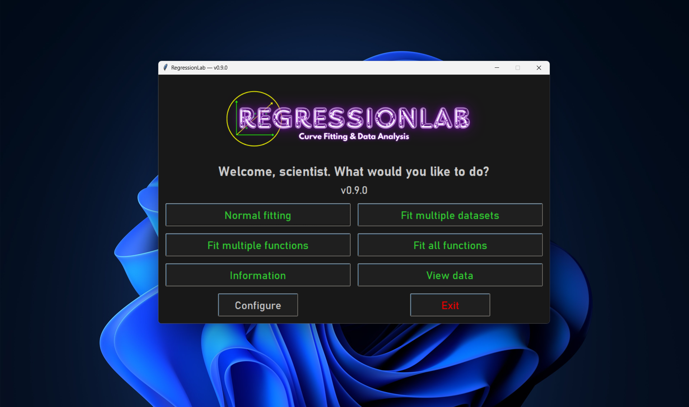
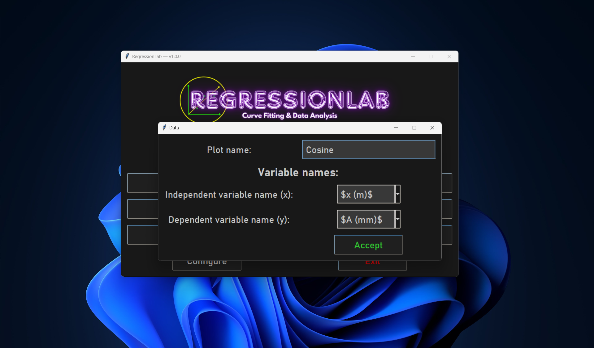
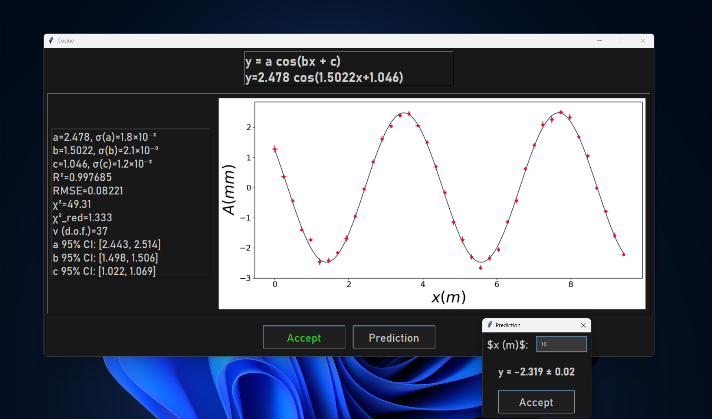
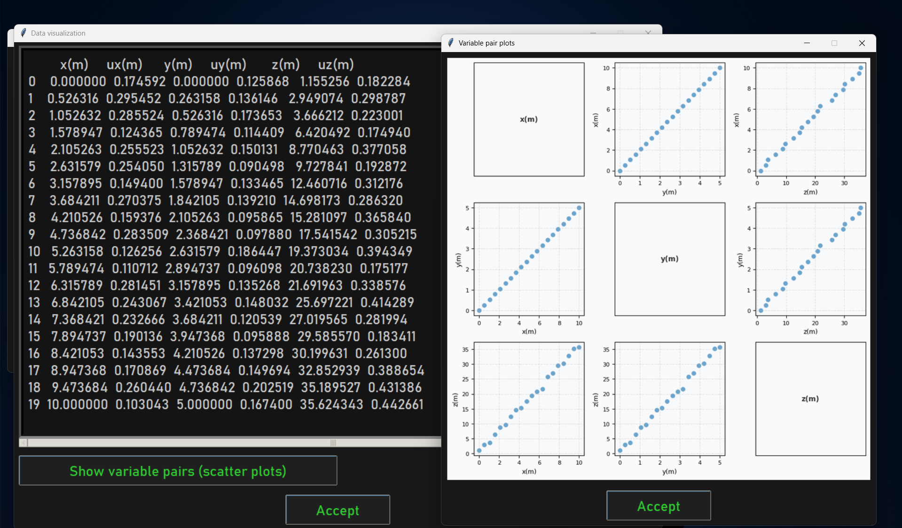

# Tkinter Guide

This guide covers the desktop application interface of RegressionLab built with Tkinter. The Tkinter version provides a full-featured native application experience with advanced options and offline capabilities.

## Overview

The Tkinter interface offers:
- **Native Performance**: Fast, responsive desktop application.
- **Offline Operation**: No internet connection required.
- **Advanced Features**: Loop mode, direct file browsing, extensive customization.
- **Traditional UI**: Familiar desktop application layout.
- **Full Control**: Access to all configuration options.

## Launching the Application

### Method 1: Desktop Shortcut

Double-click the "RegressionLab" shortcut created during installation.


### Method 2: Shell Scripts

**Windows:**
```batch
bin\run.bat
```

**macOS/Linux:**
```bash
./bin/run.sh
```

### Method 3: Direct Python Execution

```bash
# Activate virtual environment first (if using one)
source .venv/bin/activate  # macOS/Linux
.venv\Scripts\activate     # Windows

# Run the application
pythonw src/main_program.py
```

## Interface Layout

The Tkinter application uses a menu-based navigation system:

### Main Menu Window

When you launch the application, you see the main menu with buttons for each operation mode:




```
┌─────────────────────────────────────┐
│       RegressionLab v0.9.3         │
├─────────────────────────────────────┤
│                                     │
│   [ Normal Fitting ]                │
│   [ Single Fit Multiple Datasets ]  │
│   [ Checker Fitting ]               │
│   [ Total Fitting ]                 │
│   [ Watch Data ]                    │
│   [ Information ]                   │  ← Help with collapsible sections
│   [ Configure ]                     │  ← Edit .env in dialog; save restarts app
│   [ Exit ]                          │
│                                     │
└─────────────────────────────────────┘
```

- **Button colors and layout**: Configurable via `.env` or the **Configure** dialog.
- **Window size**: Adapts to content. All dialogs appear centered on screen.
- **Information**: Opens the help dialog (objective, advantages, modes, data format, locations, statistics; optional Donations button).
- **Configure**: Opens the configuration dialog; saving writes `.env` and restarts the application.

## Language

The language is set in the `.env` file or in the **Configure** dialog (Language section):

```ini
LANGUAGE="es"  # Spanish (default)
LANGUAGE="en"  # English
LANGUAGE="de"  # German (Deutsch)
```

You can also use aliases (e.g. `spanish`, `english`, `deutsch`). Change requires restarting the application.

## Operation Modes

### Mode 1: Normal Fitting

**Purpose**: Fit one equation to one dataset with optional loop mode.

**Steps**:

1. **Click "Normal Fitting"** from the main menu.

2. **Select Equation Type**:
   - Dialog appears with dropdown menu.
   
   - Choose from predefined equations:
     - Linear (y=mx)
     - Linear with intercept (y=mx+n)
     - Quadratic (y=ax²)
     - Quadratic complete (y=cx²+bx+a)
     - Fourth power (y=ax⁴)
     - Sin, Cos (with and without phase)
     - Sinh, Cosh
     - Logarithmic (y=a·ln(x))
     - Inverse (y=a/x)
     - Inverse square (y=a/x²)
   - Or select "Custom Formula" (see below).
   - Click "Accept" or press Enter.

3. **Enable/Disable Loop Mode**:
   - Dialog asks: "Do you want to enable loop mode?"
   - **Yes**: After fitting, you can modify data and refit.
   - **No**: Single fit, then return to main menu.
   - Loop mode recommended for iterative data refinement.

4. **Select Data File**:
   - Native file picker opens.
   
   - Default filter: all data files (CSV, TXT, XLSX). You can also filter by type.
   - Default location: `input/` directory.
   - Navigate to your data file and click "Open".

5. **Select Variables**:
   - Dialog shows available columns.
   
   - **Select X (independent variable)**:
     - Dropdown with all non-uncertainty columns.
     - Example: "time", "voltage", "concentration".
   - **Multidimensional (custom formulas only)**: If the equation has 2+ independent variables, a dialog asks you to select multiple X columns (e.g. first X, second X, etc.).
   - **Select Y (dependent variable)**:
     - Dropdown with remaining columns.
     - Example: "temperature", "current", "absorbance".
   - **Enter Plot Name**:
     - Text field for output filename.
     - Default: based on variable names.
     - Example: "experiment_2026".
   - Click "Accept".

6. **View Results**:
   - New window opens showing:
     
     - **Plot**: Your data with fitted curve. For 2 independent variables: interactive 3D plot (rotatable with mouse). For 3+ variables: residuals plot.
     - **Equation**: Mathematical formula with parameters.
     - **Parameters**: Values with uncertainties.
     - **R² Value**: Goodness of fit.
     - **Prediction** button: Opens a dialog to evaluate the fitted function at user-specified x values; shows predicted y with uncertainty propagation when available.
   - Plot automatically saved to `output/` directory.

7. **Loop Mode** (if enabled):
   - After viewing results, dialog asks: "Continue with this dataset?"
   - **Yes**: 
     - Modify your data file (in Excel, text editor, etc.).
     - Click Yes to reload and refit.
     - Repeat as needed.
   - **No**: Return to main menu.

**Custom Formula**:

If you select "Custom Formula":

1. **Number of Parameters**:
   - Dialog with spinbox.
   - Enter number of parameters (1-10).
   - Click "Accept".

2. **Parameter Names**:
   - Dialog appears for each parameter.
   
   - Enter meaningful names (e.g., "amplitude", "frequency", "phase").
   - Or use defaults (p1, p2, etc.).

3. **Number of Independent Variables** (optional):
   - Spinbox: 1 for standard y=f(x), 2+ for multidimensional regression.
   - Use `x_0`, `x_1`, etc. in the formula for 2+ variables.

4. **Enter Formula**:
   - Text entry dialog.
   
   - Enter formula using parameter names and `x` (or `x_0`, `x_1` for multidimensional).
   - Example: `amplitude * sin(frequency * x + phase)`.
   - Example (2 variables): `a*x_0 + b*x_1 + c`.
   - Click "Accept".

5. Continue with steps 3-8 above.

**Example Workflow**:
```
1. Click "Normal Fitting"
2. Select "Linear with intercept"
3. Enable loop mode: Yes
4. File type: Excel
5. Select: temperature_vs_time.xlsx
6. X: time (s), Y: temperature (°C)
7. Plot name: "heating_curve"
8. View results: R² = 0.92 (notice one outlier)
9. Continue: Yes
10. Edit Excel to remove outlier
11. View new results: R² = 0.99 ✓
12. Continue: No → Done!
```

### Mode 2: Single Fit Multiple Datasets

**Purpose**: Apply the same equation to multiple different datasets.

**Steps**:

1. **Click "Single Fit Multiple Datasets"** from the main menu.

2. **Select Equation Type**: (same as Normal Fitting).

3. **Enter Number of Datasets**:
   - Dialog with spinbox.
   - Enter how many datasets you want to fit (2-99).
   - Click "Accept".

4. **Enable/Disable Loop Mode**:
   - Asked once for all datasets.

5. **For Each Dataset**:
   - Select file (native file picker).
   - Select X and Y variables.
   - Enter plot name.
   - Repeat for all datasets.

6. **View All Results**:
   - Results appear sequentially.
   - Each in its own window.
   - All plots saved automatically.

7. **Loop Mode** (if enabled):
   - After all fits, ask to continue with all datasets.
   - Modify any/all data files.
   - Reload and refit all.

**Tips**:
- Prepare all data files beforehand.
- Use consistent column names across files.
- Keep file browser in same directory for faster selection.

**Example Workflow**:
```
1. Click "Single Fit Multiple Datasets"
2. Select "Quadratic"
3. Number of datasets: 3
4. Loop mode: No
5. Dataset 1:
   - File: sample_A.csv
   - X: concentration, Y: absorbance
   - Plot: "sample_A"
6. Dataset 2:
   - File: sample_B.csv
   - X: concentration, Y: absorbance
   - Plot: "sample_B"
7. Dataset 3:
   - File: sample_C.csv
   - X: concentration, Y: absorbance
   - Plot: "sample_C"
8. View 3 result windows
9. Compare parameters and R² values
```

### Mode 3: Checker Fitting (Multiple Fits Single Dataset)

**Purpose**: Test multiple equations on the same dataset.

**Steps**:

1. **Click "Checker Fitting"** from the main menu.

2. **Load Dataset**:
   - Select file (native file picker).
   - Select X and Y variables.
   - Enter plot name (used for all results).

3. **Test Equations**:
   - For each equation you want to test:
     - Dialog asks: "Select equation type".
     - Choose an equation.
     - Click "Accept".
     - View results.
     - Dialog asks: "Do you want to continue testing?"
     - **Yes**: Try another equation.
     - **No**: Return to main menu.

4. **Compare Results**:
   - Multiple result windows open.
   - Compare R² values.
   - Compare visual fit quality.
   - Choose the best equation.

**Workflow Strategy**:
```
1. Start with simple equations (linear, quadratic)
2. Try more complex if simple don't fit well
3. Stop when you find a good fit (R² > 0.95)
4. Don't over-complicate - simpler is better if fit is good
```

**Example Workflow**:
```
1. Click "Checker Fitting"
2. Load: unknown_data.xlsx
   - X: x, Y: y
   - Plot: "test"
3. Try Linear: R² = 0.65 (poor) → Continue: Yes
4. Try Quadratic: R² = 0.88 (acceptable) → Continue: Yes
5. Try Inverse: R² = 0.97 (excellent!) → Continue: No
6. Use inverse function for final analysis
```

### Mode 4: Total Fitting

**Purpose**: Automatically fit ALL available equations.

**Steps**:

1. **Click "Total Fitting"** from the main menu.

2. **Load Dataset**:
   - Select file (native file picker).
   - Select X and Y variables.
   - Enter plot name.

3. **Automatic Fitting**:
   - All predefined equations fitted automatically.
   - Result windows appear sequentially.
   - Takes 5-30 seconds depending on data size.

4. **Review All Results**:
   - Multiple windows with all fits.
   - Scan through to find highest R².
   - Choose the best-fitting equation.

**Use Cases**:
- Comprehensive analysis.
- Educational demonstrations.
- When you have no idea what equation to expect.
- Creating a fitting report with all options.

**Example Workflow**:
```
1. Click "Total Fitting"
2. Load: mystery_data.csv
   - X: t, Y: signal
   - Plot: "complete_analysis"
3. Wait for all equations to fit
4. Review results:
   - Linear: R²=0.45
   - Quadratic: R²=0.52
   - ...
   - Sin with phase: R²=0.99 ← Winner!
   - ...
   - Inverse: R²=0.31
5. Conclusion: Data shows sinusoidal behavior
```

### Mode 5: Watch Data

**Purpose**: View data file contents without fitting. Includes transform, clean, and save options.

**Steps**:

1. **Click "Watch Data"** from the main menu.

2. **Select File**:
   - Native file picker opens (default filter: all data files). Browse and select a CSV, TXT, or XLSX file.

3. **View Data**:

   

   - Dialog shows:
     - All columns and rows in table format.
     - **Row 1**: Pair plots button | Save updated data | **Help** (opens a dialog with detailed info about every option and mode, in the current language).
   - If there are more than 10 variables, clicking the pair plots button opens a variable selection dialog first (max 10 for readability).
     - **Row 2**: Transform dropdown | Transform button (same accent color as equation buttons).
     - **Row 3**: Clean dropdown | Clean button (same accent color as equation buttons).
   - Use scrollbar to navigate the table.
   - Click **Help** for a reference with collapsible sections (pair plots, transform options, clean options, save). Each transform and clean option has a detailed description. Available in Spanish, English, and German.
   - Click **Accept** when done.

4. **Transform Data** (optional):
   - Select a transform from the dropdown: FFT, FFT magnitude, inverse FFT, DCT, inverse DCT, log, log10, exp, sqrt, square, standardize (z-score), normalize [0,1], Hilbert, inverse Hilbert, envelope (Hilbert), Laplace (discrete), inverse Laplace, cepstrum (real), Hadamard (Walsh), inverse Hadamard.
   - Click **Transform** to apply. The table updates immediately.
   - If the pair plots window is open, it updates automatically.

5. **Clean Data** (optional):
   - Select a cleaning option: drop NaN rows, drop duplicates, fill NaN (mean/median/zero), or remove outliers (IQR or z-score).
   - Click **Clean** to apply. The table updates immediately.

6. **Save Updated Data** (optional):
   - Click **Save updated data** to save the current (possibly transformed/cleaned) data to CSV, TXT, or XLSX.

**Use Cases**:
- Verify data loaded correctly.
- Check column names.
- Inspect data values.
- Preview before fitting.
- Transform data (e.g. FFT, Hilbert, Laplace, log) for analysis.
- Clean data (remove outliers, fill NaN) before fitting.

### Mode 6: Information (Help)

**Purpose**: View help and application information.

**Steps**:

1. **Click "Information"** from the main menu.

2. **View Help Dialog**:
   

   - Window with scrollable content and **collapsible sections** (click the section header to expand/collapse).
   - Sections: **Objective**, **Advantages**, **Fitting Modes** (including loop mode), **Custom Functions**, **Data Format** (columns, uncertainty prefix), **Data Location** (input dir, formats), **Output Location** (plots, logs), **Statistics** (R², RMSE, χ², reduced χ², DoF, 95% parameter intervals).
   - If a donations URL is set in configuration, a **Donations** button appears at the bottom.
   - Click **Accept** (or close the window) when done.

### Configuration Dialog (Configure)

**Purpose**: Edit `.env` options without opening the file manually.

**Steps**:

1. **Click "Configure"** from the main menu.

2. **Configuration dialog**:
   

   - **Collapsible sections** (click header to expand/collapse): Language, UI, Plot, Font, Paths, Links, Updates, Logging.
   - Each option has a label and a short description; values are shown in text fields, checkboxes (for booleans), or dropdowns (for fixed options).
   - Use the scroll area and mouse wheel to move through sections.

3. **Accept or Cancel**:
   - **Accept**: Writes current values to `.env` and closes the dialog; the application then restarts so the new settings take effect.
   - **Cancel** (or close window): Discards changes and closes the dialog.

**Note**: A message at the bottom reminds you that the app will restart after saving. See the [Configuration Guide](configuration.md) for the full list of options and their meanings.

## Dialog Types

All dialogs and secondary windows open centered on screen. Small dialogs (file type, variable selection, etc.) keep their natural size. The help and configuration dialogs use fixed dimensions (900×650 and 760×800 pixels) for consistent layout with collapsible sections.

### Selection Dialogs

**Dropdown Menus**:
- Click to expand options.
- Click option to select.
- Press Enter or click "Accept".

**Radio Buttons**:
- Click one option.
- Click "Accept".

**Spinbox**:
- Type number.
- Or use up/down arrows.
- Click "Accept".

### Text Entry Dialogs

**Single Line**:
- Type text.
- Press Enter or click "Accept".
- ESC or "Cancel" to abort.

**Multi-Line** (for formulas):
- Type formula.
- Use multiple lines if needed.
- Click "Accept" when done.

### Information Dialogs

**Message Boxes**:
- Read message.
- Click "OK".

**Yes/No Dialogs**:
- Read question.
- Click "Yes" or "No".

### Result Windows

**Plot Window**:
- Shows matplotlib plot (or interactive 3D canvas for 2-variable fits; residuals plot for 3+ variables).
- Embedded in Tkinter window.
- Includes:
  - Plot image.
  - Equation text (formula with fitted values).
  - Parameters with uncertainties and 95% confidence intervals.
  - Statistics: R², RMSE, χ², reduced χ², degrees of freedom.
  - **Prediction** button: Opens a dialog to evaluate the fitted function at user-specified inputs; shows predicted y with uncertainty when available.
- Click "Close" (or "Accept") to dismiss.

## File Browsing

### Default Directories

**Input**: 
- Default: `input/` in RegressionLab directory.
- Contains sample datasets.
- Add your data files here.

**Output**:
- Default: `output/` in RegressionLab directory.
- All plots saved here automatically.
- Named according to plot name + timestamp.

### Changing Directories

In file browser:
- Navigate using folder list.
- Double-click folders to open.
- Click file to select.
- Use "Up" button to go to parent directory.

Or configure defaults in `.env`:
```ini
FILE_INPUT_DIR="path/to/your/data"
FILE_OUTPUT_DIR="path/to/your/results"
```

## Keyboard Shortcuts

While dialogs are open:
- **Space**: Accept current selection.
- **Tab**: Move between fields.

In result windows:
- **Alt+F4** (Windows/Linux) or **Cmd+W** (Mac): Close window.

Main menu:
- **Alt+F4** (Windows/Linux) or **Cmd+Q** (Mac): Quit application.

## Understanding Results

### Result Window Components


```
┌─────────────────────────────────────────────────┐
│  Plot Name - Equation Name              [X]     │
├─────────────────────────────────────────────────┤
│                                                 │
│  ╔═══════════════════════════════════════╗     │
│  ║         [Plot Image / 3D / Residuals]║     │
│  ╚═══════════════════════════════════════╝     │
│                                                 │
│  Equation: y = 5.12·x + 2.45                    │
│  R² = 0.987                                     │
│                                                 │
│  Parameter Results:                             │
│  m = 5.123 ± 0.045   [IC 95%: 5.03, 5.21]      │
│  n = 2.456 ± 0.123   [IC 95%: 2.21, 2.70]      │
│  R² = 0.987   RMSE = 0.12   χ² = ...           │
│                                                 │
│  [ Accept ]  [ Prediction ]                      │
└─────────────────────────────────────────────────┘
```

The result text includes **parameters** (value ± uncertainty and 95% confidence interval per parameter) and **statistics** (R², RMSE, χ², reduced χ², degrees of freedom). The **Information** dialog (main menu → Information) has a **Statistics** section that explains these in detail.

### Statistics Shown

- **R²**: Coefficient of determination (goodness of fit).
- **RMSE**: Root mean square error.
- **χ²**: Chi-squared.
- **χ²_red**: Reduced chi-squared.
- **DoF (ν)**: Degrees of freedom.
- **IC 95%**: 95% confidence interval for each fitted parameter.

### R² Value (Coefficient of Determination)

**Interpretation**:
- **R² = 1.0**: Perfect fit (rare in real data).
- **R² > 0.95**: Excellent fit ✓.
- **R² > 0.85**: Good fit ✓.
- **R² > 0.70**: Acceptable fit ⚠️.
- **R² < 0.70**: Poor fit — try a different equation ✗.

R² is the fraction of variance in the data explained by the model (e.g. R² = 0.95 means 95% of the variance is explained). Higher is better.

### Plot Features

**Data Points**:
- Red circles (default, configurable).
- Error bars if uncertainties present.
- Size and style from `.env`.

**Fitted Curve**:
- Black line (default, configurable).
- Smooth continuous curve.
- Based on fitted parameters.

**Axes**:
- Labels from variable names.
- Tick marks automatically scaled.
- Font and size from `.env`.

## Tips and Best Practices

### Performance

1. **Close result windows**: Free memory by closing old results.
2. **Use loop mode wisely**: Only when iteratively refining data.
3. **Large datasets**: May take longer, be patient.


### Workflow

1. **Test with small data first**: Verify setup before big analysis.
2. **Use Watch Data**: Preview, transform, clean, and save data before fitting.
3. **Start simple**: Try Normal Fitting before complex modes.
4. **Save important plots**: Copy from `output/` to safe location.


### Data Organization

1. **Keep data in `input/`**: Faster access.
2. **Use descriptive names**: "experiment1.csv" not "data.csv".
3. **One dataset per file**: Don't combine unrelated data.
4. **Backup originals**: Especially when using loop mode.


### Custom Formulas

1. **Test incrementally**: Start with simple formula, add complexity.
2. **Use meaningful parameter names**: "amplitude" not "p1".
3. **Check parentheses**: Ensure correct order of operations.
4. **Know available functions**:
   - Trig: `sin(x)`, `cos(x)`, `tan(x)`.
   - Hyperbolic: `sinh(x)`, `cosh(x)`.
   - Exponential: `exp(x)`, `log(x)`, `sqrt(x)`.
   - Powers: `x**2`, `x**0.5`.

## Troubleshooting

### Application Won't Start

**Issue**: Double-clicking shortcut does nothing.

**Solutions**:
- Run from command line to see error messages.
- Check Python installation: `python --version`.
- Verify virtual environment activated.
- Check logs: `regressionlab.log`.

### Dialogs Not Appearing

**Issue**: Clicked button but nothing happens.

**Solutions**:
- Check if dialog opened behind other windows.
- Look at taskbar for new windows.
- Press Alt+Tab to cycle through windows.
- Check if application is frozen (wait indicator).

### File Browser Empty

**Issue**: No files shown in file browser.

**Solutions**:
- Navigate to correct directory.
- Check file extensions (CSV, XLSX, TXT).
- Verify files exist in expected location.
- Use absolute path in `.env` for input directory.

### Fitting Fails

**Issue**: Error message after selecting variables.

**Solutions**:
- Check data format (numeric values only).
- Ensure sufficient data points (>5).
- Verify X and Y columns exist.
- Check for NaN or infinite values.
- Try different equation type.

### Result Window Too Large/Small

**Issue**: Result window doesn't fit screen.

**Solutions**:
- Adjust plot size in `.env`:
  ```ini
  PLOT_FIGSIZE_WIDTH=10
  PLOT_FIGSIZE_HEIGHT=5
  ```
- Restart application.
- Use smaller font sizes.

### Colors Look Wrong

**Issue**: Text unreadable or colors clash.

**Solutions**:
- Edit `.env` color settings.
- Use high contrast combinations:
  - Dark background + light text.
  - Light background + dark text.
- Restart application.

## Advanced Features

### Loop Mode Strategies

**Strategy 1: Outlier Removal**
```
1. Fit data
2. Identify outliers in plot
3. Edit data file to remove outliers
4. Reload and refit
5. Repeat until clean data
```

**Strategy 2: Parameter Exploration**
```
1. Fit with all data
2. Note parameters
3. Remove specific range
4. Refit and compare parameters
5. Understand data sensitivity
```

**Strategy 3: Uncertainty Testing**
```
1. Fit with estimated uncertainties
2. Adjust uncertainty columns
3. Refit and see effect on parameter errors
4. Find realistic uncertainty estimates
```

### Batch Processing Workflow

For processing many similar files:

```
1. Prepare all files in input/
2. Use consistent naming: exp1.csv, exp2.csv, etc.
3. Use "Single Fit Multiple Datasets"
4. Enter number of files
5. Disable loop mode for speed
6. Quickly select each file
7. All results saved automatically
8. Review output/ directory for all plots
```

### Customization

See [Configuration Guide](configuration.md) for extensive customization:
- Colors and themes.
- Plot styles.
- Fonts and sizes.
- Directories.
- Logging.

## Differences from Streamlit Version

**Tkinter has**:
- ✓ Loop mode for iterative fitting.
- ✓ Direct file system access.
- ✓ Offline operation.
- ✓ Extensive customization via `.env`.
- ✓ Native desktop performance.
- ✓ Prediction window (evaluate fitted function at user inputs; uncertainty propagation).
- ✓ Multidimensional fitting (custom formulas with 2+ variables; 3D/residuals plots).
- ✓ Data view with transform, clean, and save (FFT, Hilbert, Laplace, DCT, log, outliers, etc.).

**Tkinter lacks**:
- ✗ Modern web UI.
- ✗ Easy sharing (URL-based).
- ✗ Mobile/tablet support.
- ✗ Automatic cloud storage.

**When to use each**:
- **Tkinter**: Serious analysis, offline work, advanced features.
- **Streamlit**: Quick checks, sharing, accessibility.

## Next Steps

- **Customize Interface**: Edit `.env` to personalize appearance ([Configuration Guide](configuration.md)).
- **Add Functions**: Learn to extend RegressionLab ([Extending RegressionLab](extending.md)).
- **Web Version**: Try the Streamlit interface ([Streamlit Guide](streamlit-guide.md)).

---

*Master the desktop interface! Check [Troubleshooting](troubleshooting.md) for help with any issues.*
