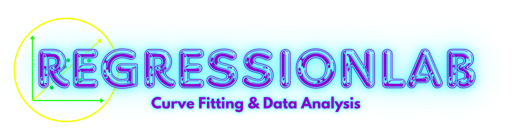

.. raw:: html

   

   
   <h1>RegressionLab</h1>
   
   
<strong>A powerful and user-friendly curve fitting application for scientists, engineers, students, and data analysts</strong>

   
   

   
   
   
   
   
   
   

   
   

   <a href="https://regressionlab.streamlit.app/" target="_blank"><strong>🌐 Try Online</strong></a> • 
   <a href="introduction.html"><strong>📖 Documentation</strong></a> • 
   <a href="https://github.com/DOKOS-TAYOS/RegressionLab/issues" target="_blank"><strong>🐛 Report Bug</strong></a> • 
   <a href="https://github.com/DOKOS-TAYOS/RegressionLab/issues" target="_blank"><strong>💡 Request Feature</strong></a>
   

   
   

   
   

RegressionLab Documentation
============================

**RegressionLab** is a comprehensive curve fitting application that enables you to perform advanced curve fitting operations using multiple mathematical models with an intuitive interface. Whether you're analyzing experimental data, calibrating instruments, or exploring mathematical relationships, RegressionLab provides the tools you need.

.. toctree::
   :maxdepth: 2
   :caption: Getting Started
   
   introduction
   installation
   usage

.. toctree::
   :maxdepth: 2
   :caption: Configuration & Customization
   
   configuration
   streamlit-guide
   tkinter-guide

.. toctree::
   :maxdepth: 2
   :caption: For Developers
   
   extending
   customization
   api/index

.. toctree::
   :maxdepth: 2
   :caption: Reference & Support
   
   troubleshooting
   contributing
   license

.. toctree::
   :maxdepth: 3
   :caption: API Reference
   
   modules/core
   modules/fitting
   modules/loaders
   modules/plotting
   modules/frontend
   modules/streamlit_app
   modules/utils
